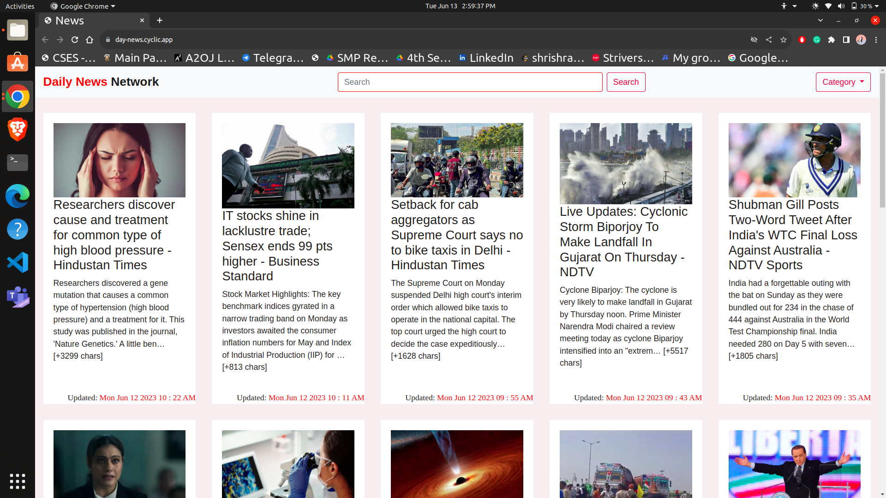

# dayNews
<br>

<!-- TABLE OF CONTENTS -->
<details>
  <summary>Table of Contents</summary>
  <ol>
    <li>
      <a href="#description">Description</a>
      <ul>
        <li><a href="#website-link">Website Link</a></li>
      </ul>
    </li>
    <li>
      Getting Started
      <ul>
       <li><a href="#requirements"> Requirements</a></li>
       <li><a href="#installation"> Installation</a></li>
      </ul>
    </li>
       <li><a href="#maintainers-👨‍💻">Maintainers</a></li>
    <li><a href="#licence-🍁">Licence</a></li>
    <li><a href="#contributing-💙">Contributing</a></li>
    <li><a href="#💖-like-this-project">Like this project</a></li>
  </ol>
</details>


## Description
Welcome to The [**dayNews**](https://day-news.cyclic.app/), your go-to destination for timely and reliable news from around the globe. We strive to bring you the most comprehensive coverage of national and international events, ensuring you stay informed and engaged in today's rapidly changing world.

## Website Link

https://day-news.cyclic.app/

## Screenshot
<p align="left">
  
  
</p>
<br>
<br>

## Requirements
[dayNews](https://github.com/ShrishRajGupta/dayNews) is a NodeJS application based on **News API**.

For the codebase use the package manager [npm](https://www.npmjs.com/) to install [dayNews](https://github.com/ShrishRajGupta/dayNews).

<br>

## Installation
```bash
git clone https://github.com/ShrishRajGupta/dayNews.git
npm install
nodemon app.js
```

## Maintainers 👨‍💻

- ### [Shrish Raj Gupta](https://github.com/ShrishRajGupta)   [](https://www.linkedin.com/in/shrishrajgupta/)
- ### [Abhishek Yadav](https://github.com/AbhishekYMNNIT)  [](https://www.linkedin.com/in/abhishekyadav123/)

## Licence 🍁
**MIT**

## Contributing 💙

PR's are welcome!

Found a Bug? Create an Issue.

## 💖 Like this project?

Leave a ⭐ If you think this project is cool.